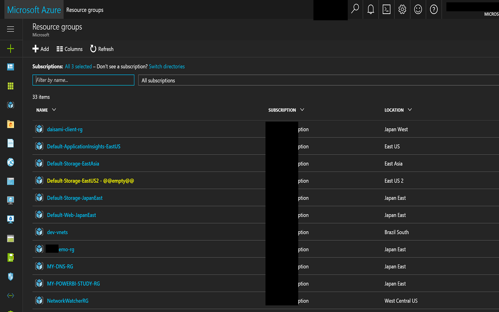
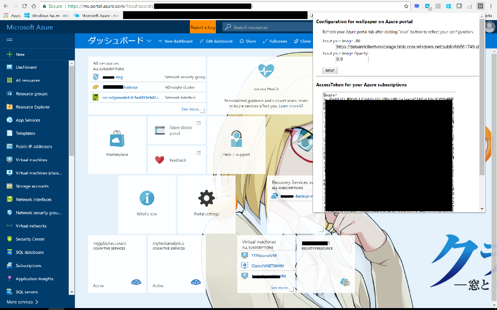

My Azure Portal Extension
============================

This extension can enhance user experience of [Microsoft Azure Portal](https://portal.azure.com/).

## How to install

Go to https://chrome.google.com/webstore/detail/jdaghfledaciocaiddjgcaamlcdhijjh/publish-delayed?hl=en using Chrome browser and add this extension into yoru chrome browser.

# Offering features

No.1: You can highlight empty resourcegroups on Azure Portal like below.

No.2: You can extract your AccessToken via popup window of this extension, and you can use the AccessToken for Azure REST APIs as development usage.

No.3: You can setup your wallpaper as you wish on Azure Portal top like below and you can also specify image url and image opacity.

## Reference for development

- https://developer.chrome.com/extensions/webRequest
- https://github.com/otiai10/kanColleWidget/wiki/%E5%A4%96%E9%83%A8Chrome%E6%8B%A1%E5%BC%B5%E9%80%A3%E6%90%BA%E3%81%AB%E3%81%A4%E3%81%84%E3%81%A6
- http://qiita.com/mdstoy/items/9866544e37987337dc79
- http://stackoverflow.com/questions/15502691/chrome-webrequest-not-working
- https://docs.microsoft.com/en-us/rest/api/
- http://easyramble.com/chrome-storage-set-and-get.html

## Copyright
<table>
  <tr>
    <td>Copyright</td><td>Copyright (c) 2017- Daichi Isami</td>
  </tr>
  <tr>
    <td>License</td><td>MIT License</td>
  </tr>
</table>
