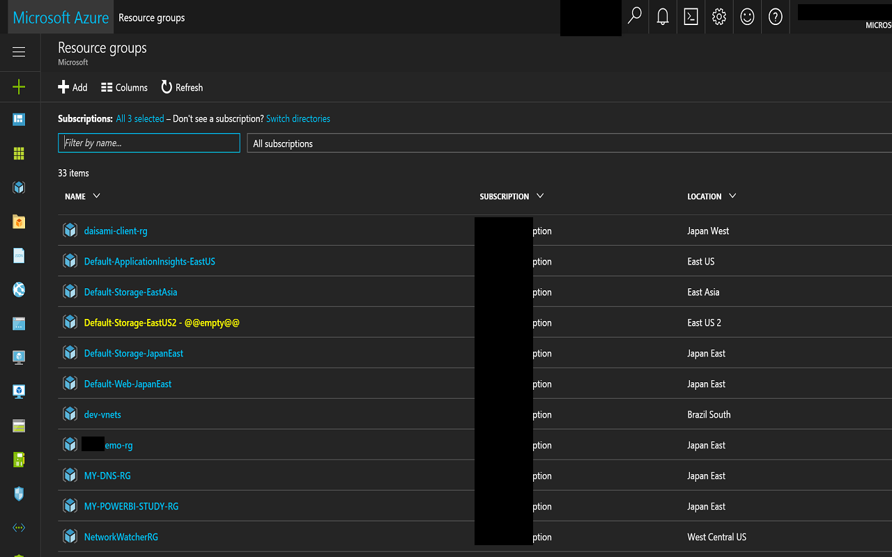
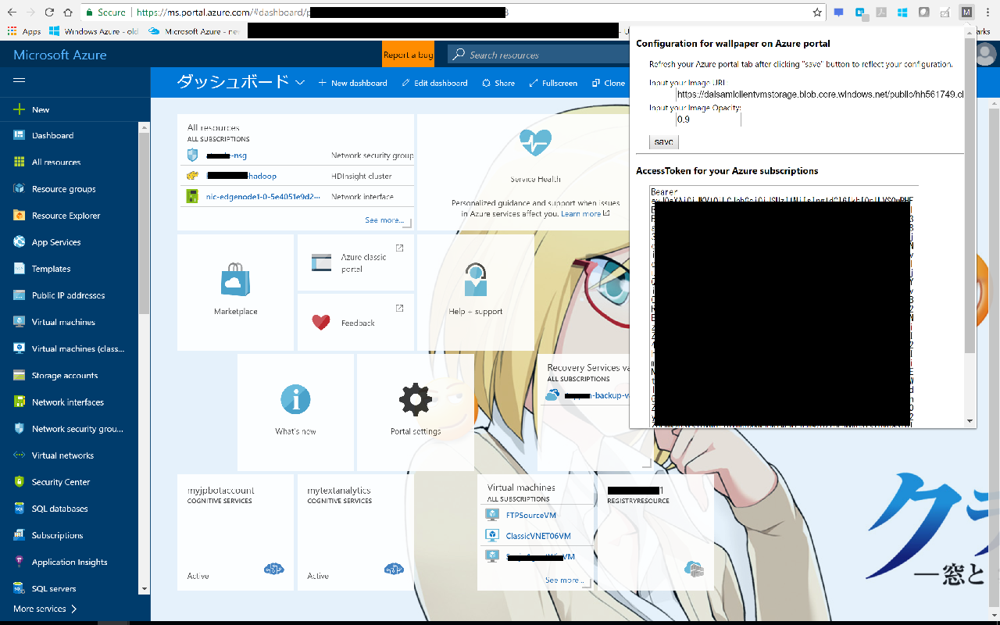
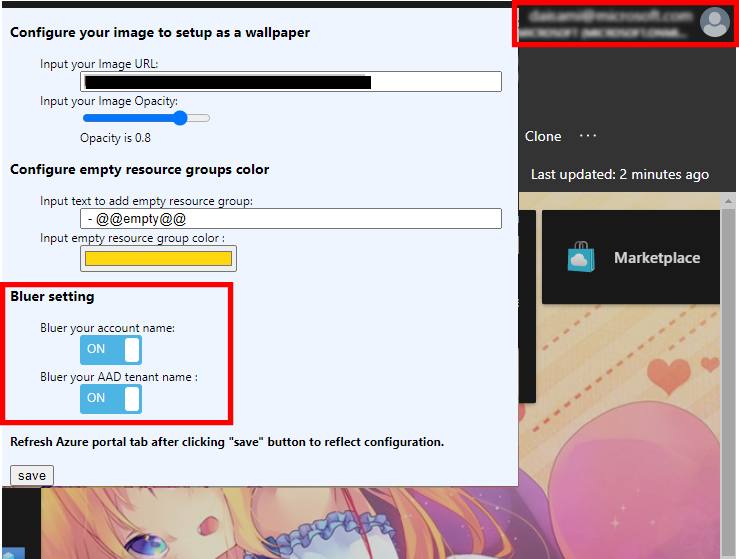
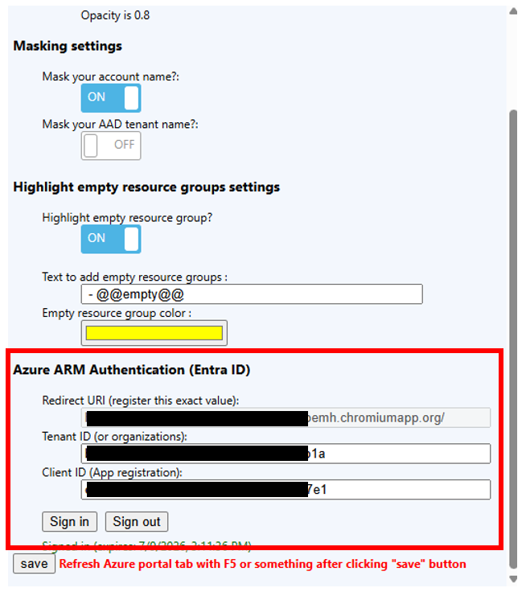
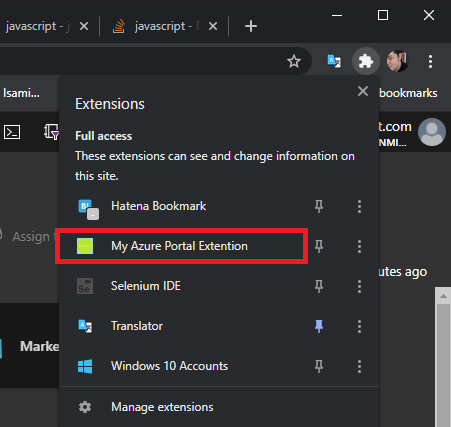

My Azure Portal Extension
============================

This extension works to enhance user experience of [Microsoft Azure Portal](https://portal.azure.com/).

## Supported browsers
- Chrome
- Edge - just open a link as follows and add Chrome Extension on your Edge browser

## How to install

Open https://chrome.google.com/webstore/detail/my-azure-portal-extention/jdaghfledaciocaiddjgcaamlcdhijjh with Edge or Chrome browser and add this extension.

## Features

No.1: Highlight empty resource group.

No.2: Configure Azure Portal background image with image url and image opacity.

No.3: Bluer username or Entra Tenant name on Azure Portal.

No.4: Entra ID sign-in with automatic token refresh for ARM API calls.

## How to configure them
Click extension icon on your browser first, then setting popup of this Extension will be shown.

Configure this exntesion with the view as follows.

For ARM API authentication in v0.4.0, this is now a sign-in flow:

1. Enter `Tenant ID` and `Client ID`.
2. Click `save`.
3. Click `Sign in`.

No manual access-token copy/paste is required.

## Authentication for ARM API (Entra ID)

This extension now works as an independent OAuth client. It does not rely on the Azure portal session token.

### Quick start (v0.4.0)

1. Register an Entra ID App as SPA (one-time setup).
2. Set `Tenant ID` and `Client ID` in the popup.
3. Click `Sign in`.

The extension stores tokens in `chrome.storage.local` and refreshes them automatically before expiration.

### Important prerequisites

- You must create and register a Service Principal (App registration) in Entra ID before using ARM authentication in this extension.
  - MS Learn: https://learn.microsoft.com/entra/identity-platform/quickstart-register-app
- In the extension popup, copy the value shown in **Redirect URI (register this exact value)** and register that exact value in the Service Principal Redirect URI.
  - MS Learn: https://learn.microsoft.com/entra/identity-platform/how-to-add-redirect-uri
- Register the Service Principal as **Single-page application (SPA)**.
  - MS Learn: https://learn.microsoft.com/entra/identity-platform/v2-oauth2-auth-code-flow#redirect-uris-for-single-page-apps-spas

### 1. Register an Entra ID app

Create a new App registration in Entra ID and configure it as SPA.

- Platform: Single-page application (SPA)
- Redirect URI: value returned by `chrome.identity.getRedirectURL()`
  - Example: `https://<your-extension-id>.chromiumapp.org/`
- API permission: `https://management.azure.com/user_impersonation`
- Recommended scopes in sign-in flow: `openid profile offline_access`

### 2. Configure this extension

Open the extension popup and set:

- Tenant ID (or `organizations`)
- Client ID (from App registration)

Click `save`, then click `Sign in` once.

### 3. Token lifecycle

- Access and refresh tokens are saved in `chrome.storage.local`.
- The service worker refreshes token silently before expiration using `chrome.alarms`.
- If silent refresh cannot continue (e.g. revoked consent), sign in again from the popup.

### Legacy flow (deprecated)

Older versions used manual token acquisition (for example, running `az account get-access-token` and pasting a short-lived token into the extension).

This workflow is deprecated in v0.4.0 and is no longer recommended.

### 4. Required permissions (manifest)

The extension uses the following permissions and hosts:

- `identity`, `storage`, `alarms`
- `https://login.microsoftonline.com/*`
- `https://management.azure.com/*`

If ARM calls fail, check extension logs from the extension service worker in browser developer tools.

## Release notes

See [CHANGELOG.md](CHANGELOG.md) for the v0.1.0 to v0.4.0 summary.

## Reference for development

- https://developer.chrome.com/extensions/webRequest
- https://github.com/otiai10/kanColleWidget/wiki/%E5%A4%96%E9%83%A8Chrome%E6%8B%A1%E5%BC%B5%E9%80%A3%E6%90%BA%E3%81%AB%E3%81%A4%E3%81%84%E3%81%A6
- http://qiita.com/mdstoy/items/9866544e37987337dc79
- http://stackoverflow.com/questions/15502691/chrome-webrequest-not-working
- https://docs.microsoft.com/en-us/rest/api/
- http://easyramble.com/chrome-storage-set-and-get.html
- https://qiita.com/nulltypo/items/4e5c494971955c767531

## Copyright
<table>
  <tr>
    <td>Copyright</td><td>Copyright (c) 2017 - Daichi Isami</td>
  </tr>
  <tr>
    <td>License</td><td>MIT License</td>
  </tr>
</table>
