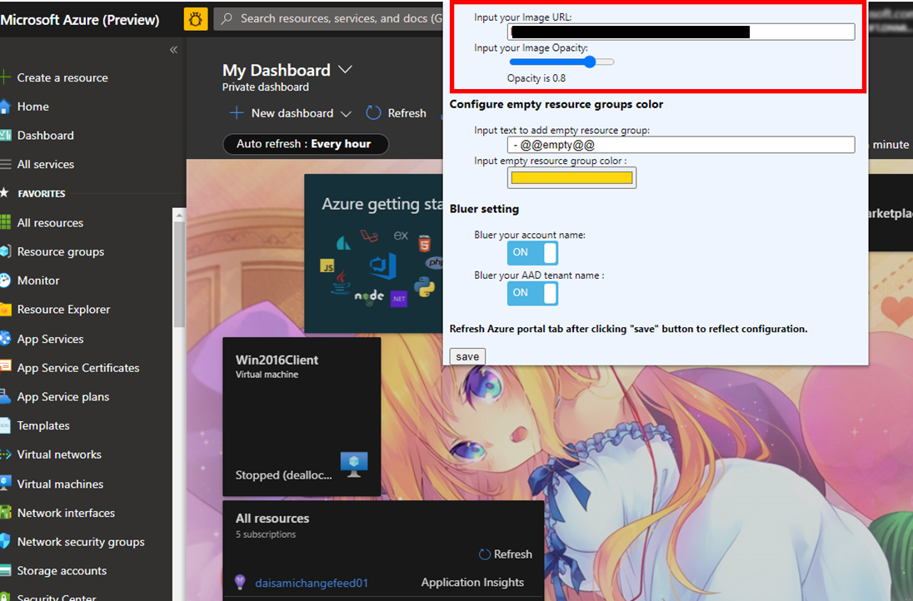
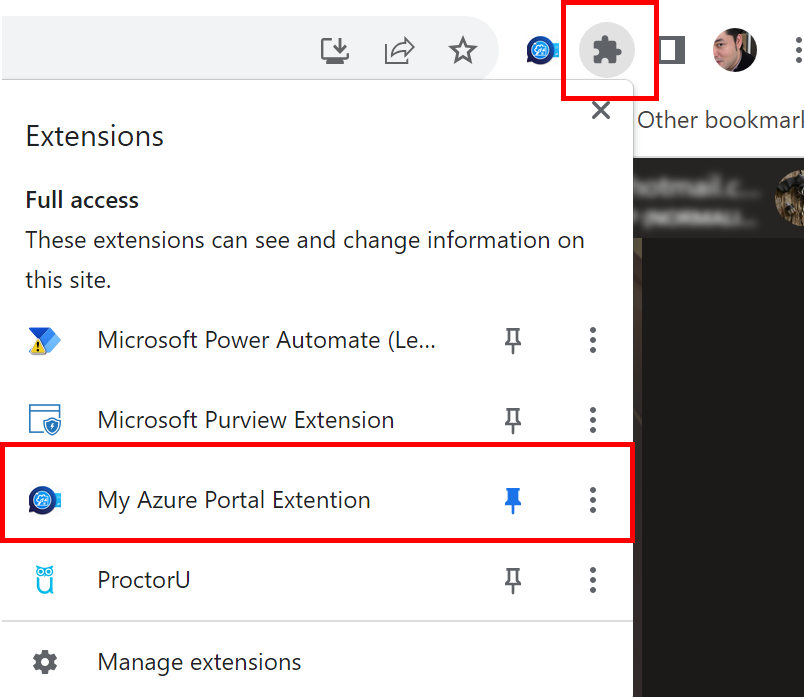

My Azure Portal Extension
============================

This extension works to enhance user experience of [Microsoft Azure Portal](https://portal.azure.com/).

## Supported browsers
- Chrome
- Edge - just open a link as follows and add Chrome Extension on your Edge browser

## How to install

Open https://chrome.google.com/webstore/detail/my-azure-portal-extention/jdaghfledaciocaiddjgcaamlcdhijjh with Edge or Chrome browser and add this extension.

## Features

No.1: Highlight empty resource group.

No.2: Configure Azure Portal background image with image url and image opacity.

No.3: Bluer username or Entra Tenant name on Azure Portal.

## How to configure them
Click extension icon on your browser first, then setting popup of this Extension will be shown.

Configure this exntesion with the view as follows.

In You can get AccessToken by executing "az account get-access-token" command. Refer the document as follows. 
https://learn.microsoft.com/en-us/azure/healthcare-apis/get-access-token?tabs=azure-cli
Note that AccessToek expires within 30-60min, so you have to replace new one if this extension does not works well. 

Check the error message with F12 Developer tool as follows when this extension does not works well. AccessToken is expired in this example. 

## Reference for development

- https://developer.chrome.com/extensions/webRequest
- https://github.com/otiai10/kanColleWidget/wiki/%E5%A4%96%E9%83%A8Chrome%E6%8B%A1%E5%BC%B5%E9%80%A3%E6%90%BA%E3%81%AB%E3%81%A4%E3%81%84%E3%81%A6
- http://qiita.com/mdstoy/items/9866544e37987337dc79
- http://stackoverflow.com/questions/15502691/chrome-webrequest-not-working
- https://docs.microsoft.com/en-us/rest/api/
- http://easyramble.com/chrome-storage-set-and-get.html
- https://qiita.com/nulltypo/items/4e5c494971955c767531
- https://learn.microsoft.com/en-us/azure/healthcare-apis/get-access-token?tabs=azure-cli

## Copyright
<table>
  <tr>
    <td>Copyright</td><td>Copyright (c) 2017 - Daichi Isami</td>
  </tr>
  <tr>
    <td>License</td><td>MIT License</td>
  </tr>
</table>
